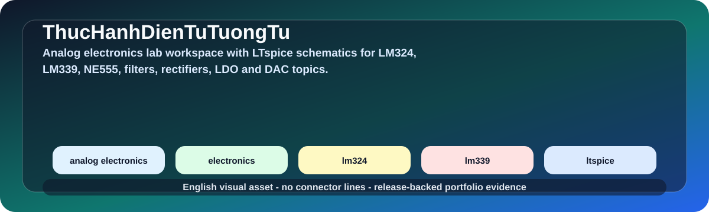

# Analog Electronics LTspice Lab Workspace

  
  
  

  

## Overview

This repository collects analog-electronics lab schematics and documentation with LTspice circuits for op-amp, comparator, timer, filter, rectifier, LDO and DAC topics.

| Field | Details |
|---|---|
| Repository | [ThucHanhDienTuTuongTu](https://github.com/lhlizdabezt/ThucHanhDienTuTuongTu) |
| Portfolio category | Analog electronics lab repository |
| Primary stack | LTspice, analog circuits, LM324, LM339, NE555, filters, oscillators, rectifiers, LDO, DAC. |
| Latest release | [GitHub Releases](https://github.com/lhlizdabezt/ThucHanhDienTuTuongTu/releases/latest) |
| Tags | [Version tags](https://github.com/lhlizdabezt/ThucHanhDienTuTuongTu/tags) |
| Owner profile | [Luong Hai Long](https://github.com/lhlizdabezt) |

## Reviewer Map

| What to Review | Where to Look | Why It Matters |
|---|---|---|
| Technical scope | This README and source tree | Gives a quick, bounded reading path before opening every file |
| Evidence assets | Release page and top-level project files | Shows what can be downloaded or inspected quickly |
| Implementation material | Source folders, scripts, notebooks or design files | Connects the portfolio claim to real project artifacts |
| Version history | Tags and release notes | Makes the repository easier to audit over time |

## Evidence Highlights

- LM324 and LM339 op-amp/comparator circuits.
- NE555 timer and oscillator exercises.
- Active filters, rectifiers, LDO and DAC-related circuits.
- Lab documentation and motion/visual portfolio assets.

## Repository Structure

| Path | Purpose |
|---|---|
| `assets/` | Top-level directory included in the repository |
| `CoHa/` | Top-level directory included in the repository |
| `docs/` | Top-level directory included in the repository |
| `Bai 5 Cau 2.pdf` | Top-level file included in the repository |
| `Bai 5 Cau 3.pdf` | Top-level file included in the repository |
| `Labs Dientu_tuongtu_unlocked.pdf` | Top-level file included in the repository |
| `LM324 Texas.pdf` | Top-level file included in the repository |
| `LM339N texas.pdf` | Top-level file included in the repository |

## Scope and Boundaries

Course/lab simulation evidence for analog electronics. It is not production analog design sign-off.

## Role and Portfolio Context

Luong Hai Long keeps this repository as circuit-foundation evidence supporting hardware and validation roles.

## Release and Tagging Notes

This repository is maintained as part of an English-facing engineering portfolio. Releases and tags are used to preserve reviewable snapshots of the project, including source state, documentation updates and any available visual or report assets.

## Writing Standard

The README follows an evidence-first style: direct technical nouns, clear project boundaries, release-backed artifacts and no inflated claims beyond what the repository can support.
