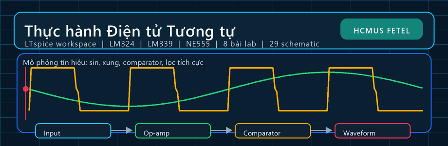

# Analog Electronics LTspice Laboratory Archive

  

This archive keeps the supplied Analog Electronics laboratory manual, LTspice schematics, simulation outputs, selected exercise notes, and LM324/LM339 technical data. It is coursework evidence for circuit analysis and simulation, not a fabricated-hardware validation claim.

## Evidence map

| Material | Path | Review use |
|---|---|---|
| Laboratory schematics | [`CoHa/`](CoHa/) | LTspice `.asc` files for preparation and practice across eight lab sets. |
| Device models | [`CoHa/LM324.cir`](CoHa/LM324.cir), [`CoHa/LM339.cir`](CoHa/LM339.cir) | Simulation support for operational-amplifier and comparator exercises. |
| Lab manual | [`Labs Dientu_tuongtu_unlocked.pdf`](Labs%20Dientu_tuongtu_unlocked.pdf) | 106-page supplied laboratory reference. |
| Datasheets | [`LM324 Texas.pdf`](LM324%20Texas.pdf), [`LM339N texas.pdf`](LM339N%20texas.pdf) | Manufacturer device references. |
| Exercise records | [`Bai 5 Cau 2.pdf`](Bai%205%20Cau%202.pdf), [`Bai 5 Cau 3.pdf`](Bai%205%20Cau%203.pdf), [`LYTHUYET.pdf`](LYTHUYET.pdf) | Supplied supplementary notes retained without altering their source-language content. |

## Review workflow

1. Read the laboratory manual and datasheet conditions before changing a schematic.
2. Open a selected `.asc` file in LTspice with the referenced model files available.
3. Check the supply rails, model pin order, operating point, transient settings, and measurement units.
4. Treat `.raw`, `.log`, `.op.raw`, and `.db` files as simulation evidence tied to their matching schematic.
5. Record limitations from simulation separately from any physical measurement.

## Scope

The repository shows simulation and documentation work around LM324, LM339, and NE555-related exercises present in the supplied files. It does not claim PCB production, laboratory calibration, or product qualification. Lecturer materials and datasheets are preserved in their original form for provenance.

## Release

The [2026 portfolio refresh](https://github.com/lhlizdabezt/ThucHanhDienTuTuongTu/releases/tag/portfolio-refresh-2026-08-29) provides a tagged source snapshot and the checked laboratory visual. See [`RELEASE_NOTES.md`](RELEASE_NOTES.md).

## Profile and contact

[GitHub](https://github.com/lhlizdabezt) · [LinkedIn](https://www.linkedin.com/in/lhlizdabezt) · [Facebook](https://www.facebook.com/wageseadrake) · [Instagram](https://www.instagram.com/lhlizdabezt) · [YouTube](https://www.youtube.com/@lhlizdabezt) · [TikTok](https://www.tiktok.com/@wageseadrake) · [22207056@student.hcmus.edu.vn](mailto:22207056@student.hcmus.edu.vn) · [luonghailong.work@gmail.com](mailto:luonghailong.work@gmail.com) · [+84988114708](tel:+84988114708)
