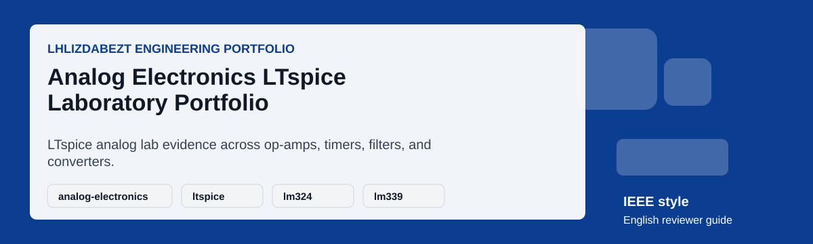

# Analog Electronics LTspice Laboratory Portfolio

## Executive Summary

This repository presents an analog electronics lab workspace with LTspice evidence across rectifier, filter, regulator, op-amp, comparator, timer, and converter topics. The public guide translates the lab archive into recruiter-readable engineering evidence while preserving the circuit-simulation focus.

## Project Snapshot

| Field | Details |
|---|---|
| Repository | [lhlizdabezt/ThucHanhDienTuTuongTu](https://github.com/lhlizdabezt/ThucHanhDienTuTuongTu) |
| Portfolio Track | Analog electronics, LTspice simulation, op-amp/comparator/timer circuits, and lab evidence |
| Public Status | Reviewer-ready English guide with release-backed evidence |
| Latest Release | [Open stable release](https://github.com/lhlizdabezt/ThucHanhDienTuTuongTu/releases/latest) |
| Owner Profile | [lhlizdabezt](https://github.com/lhlizdabezt) |
| Contact | 22207056@student.hcmus.edu.vn; luonghailong.work@gmail.com; Tel: +84988114708 |

## Reviewer Evidence Map

- Twenty-nine LTspice schematics across eight lab modules, with simulation-focused organization.
- LM324 and LM339 SPICE macromodel/symbol support plus NE555 timing-circuit evidence.
- Organized public README language for academic and HR review.
- Motion and SVG assets that summarize the analog lab without blocking source inspection.

## Implementation Review Notes

| Review Point | What To Check |
|---|---|
| Problem framing | Confirm that the README explains the engineering purpose without exaggerated claims. |
| Technical evidence | Inspect the source folders, reports, scripts, schematics, or visual assets listed below. |
| Reproducibility | Use the local instructions where tools are available, or rely on the release snapshot for portfolio review. |
| Communication quality | Check headings, captions, tables, and release notes for clear English technical writing. |
| Professional boundary | Treat the repository as educational or portfolio evidence unless the source explicitly proves production deployment. |

## Repository Structure

| Path | Reviewer Purpose |
|---|---|
| `CoHa/` | LTspice lab folders and simulation evidence. |
| `assets/` | Analog lab motion preview and English reviewer card. |
| `*.asc` | LTspice schematic files when present in lab folders. |
| `RELEASE_NOTES.md` | Release changelog for the English reviewer guide. |

## How To Review

- Read this README to understand the lab topic map and reviewer scope.
- Open schematic files in LTspice to inspect circuit topology and simulation setup.
- Check op-amp, comparator, timer, filter, rectifier, LDO, and DAC evidence by folder.
- Use the latest release as the stable public review snapshot.

## How To Use Or Inspect Locally

- Install LTspice if you want to inspect or rerun schematics locally.
- Open the relevant `.asc` schematic from the lab folder you want to review.
- Confirm model files and symbols are available before running simulation.
- Use the README and release notes to understand the public portfolio framing.

## Visual Evidence

*Animated English reviewer card.*

## Release, Tags, And Topics

- Current release target: `reviewer-guide-2026-06-02`.
- Recommended topic set: `analog-electronics, ltspice, lm324, lm339, ne555, op-amp, comparator, filters, rectifier, circuit-simulation`.
- Release notes are maintained in [`RELEASE_NOTES.md`](RELEASE_NOTES.md) for stable reviewer traceability.
- The release archive is intended for HR review, seminar evidence, and academic portfolio verification.

## Contact And Professional Links

| Channel | Link |
|---|---|
| GitHub | [https://github.com/lhlizdabezt](https://github.com/lhlizdabezt) |
| LinkedIn | [https://www.linkedin.com/in/lhlizdabezt](https://www.linkedin.com/in/lhlizdabezt) |
| Facebook | [https://www.facebook.com/wageseadrake](https://www.facebook.com/wageseadrake) |
| Instagram | [https://www.instagram.com/lhlizdabezt](https://www.instagram.com/lhlizdabezt) |
| YouTube | [https://www.youtube.com/@lhlizdabezt](https://www.youtube.com/@lhlizdabezt) |
| TikTok | [https://www.tiktok.com/@wageseadrake](https://www.tiktok.com/@wageseadrake) |
| Academic Email | [22207056@student.hcmus.edu.vn](mailto:22207056@student.hcmus.edu.vn) |
| Professional Email | [luonghailong.work@gmail.com](mailto:luonghailong.work@gmail.com) |
| Phone | [+84988114708](tel:+84988114708) |

## FAQ

| Question | Answer |
|---|---|
| What is the strongest evidence in this repository? | The strongest evidence is the organized LTspice schematic set across multiple analog lab modules. |
| Does the repository include physical measurement data? | The public wrapper emphasizes LTspice simulation evidence; physical measurement context depends on the original lab artifacts. |
| What should recruiters notice? | Circuit literacy, simulation practice, disciplined organization, and public technical communication. |

## Scope And Boundaries

- This repository is presented as public engineering portfolio evidence.
- Claims are intentionally limited to what the repository, report, source files, simulations, or visual assets can support.
- Public text is written in English (United States) for HR, faculty, and engineering reviewers.
- SVG text is kept ASCII-safe to reduce rendering errors, mojibake, and missing-glyph blocks.
- Motion visuals avoid moving dotted paths, curved connector lines, and text-over-line compositions.

## Writing Standard

The public README, release notes, captions, and reviewer-facing metadata are written in a restrained IEEE and Harvard-inspired style: concise, evidence-first, technically accurate, and suitable for Electronics and Telecommunications portfolio review.
